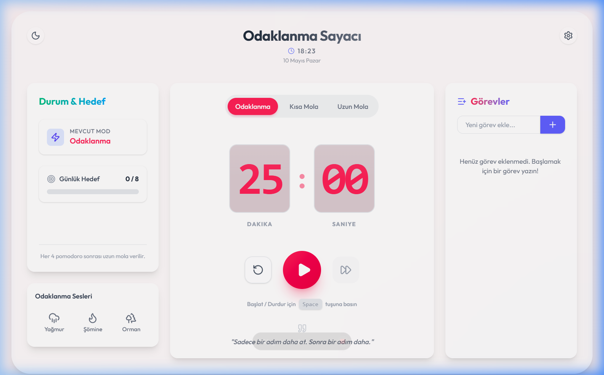
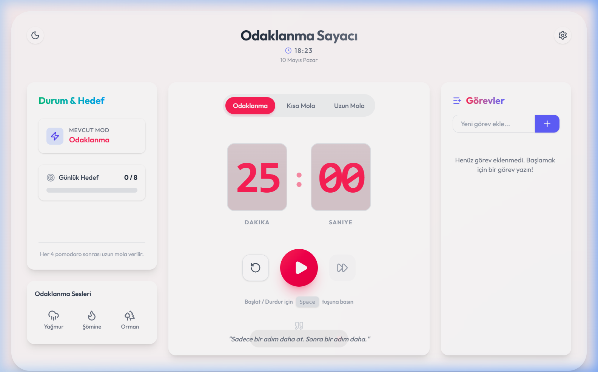
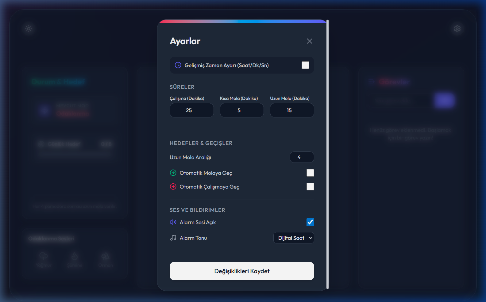
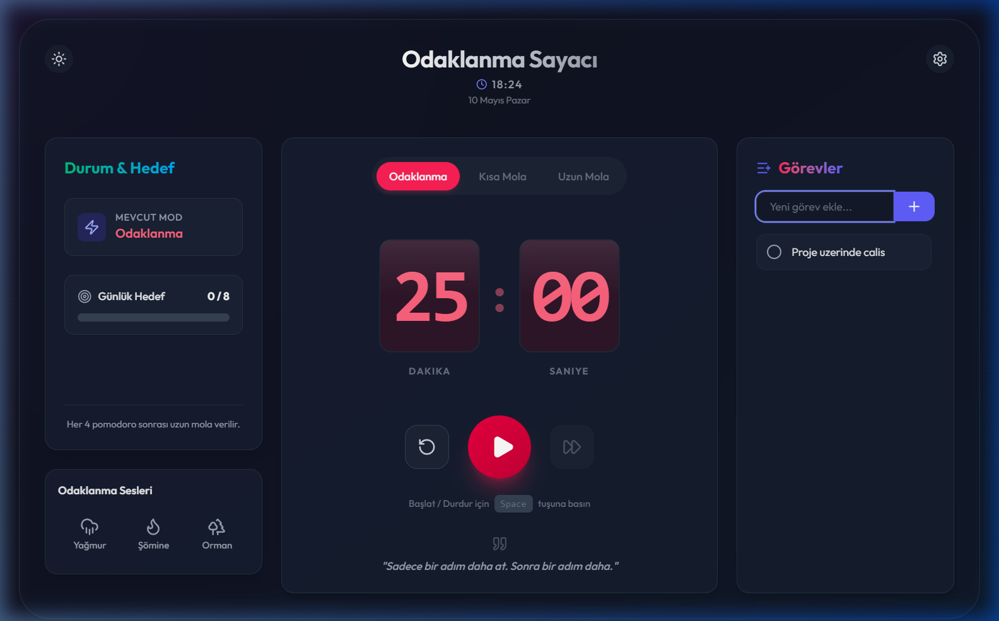
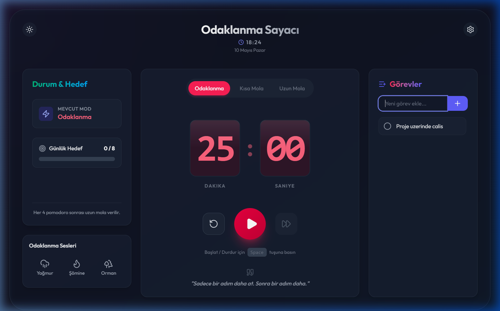
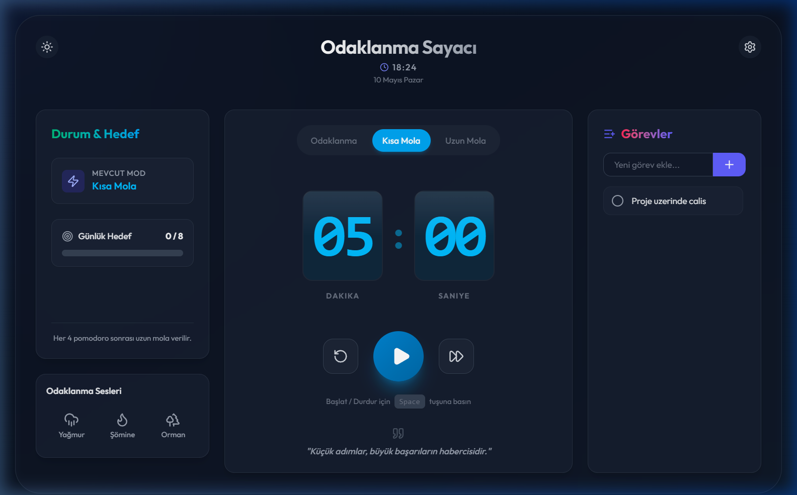
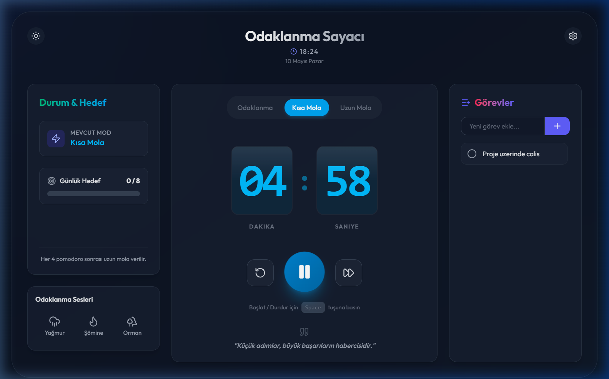

<div align="center">


<br/>

<a href="https://github.com/ziyaguner/pomodoro-app">
  
</a>

<br/><br/>

[](https://reactjs.org/)
[](https://vitejs.dev/)
[](https://tailwindcss.com/)
[](https://www.framer.com/motion/)
[](https://lucide.dev/)
[](LICENSE)

<br/>

<p align="center">
  <b>Pomodoro App</b>, glassmorphism tasarım dili ve akıcı animasyonlarla inşa edilmiş<br/>
  modern bir odaklanma & verimlilik zamanlayıcısıdır.<br/>
  Dark/Light mod · Ortam sesleri · Görev takibi · Özelleştirilebilir zamanlayıcı
</p>

</div>

---

## 📸 Ekran Görüntüleri

### 🌞 Ana Ekran (Light Mode)

<div align="center">

</div>

<br/>

### 🌙 Dark Mode

<div align="center">

</div>

<br/>

### ⚙️ Ayarlar Paneli

<div align="center">

</div>

<br/>

### 📋 Görev Yönetimi

<div align="center">

</div>

<br/>

### 📊 Durum & Günlük Hedef

<div align="center">

</div>

<br/>

### ☕ Kısa Mola Modu

<div align="center">

</div>

<br/>

### ▶️ Sayaç Çalışıyor

<div align="center">

</div>

---

## ✨ Özellikler

<table>
<tr>
<td width="50%">

### 🍅 Pomodoro Tekniği
Klasik Pomodoro döngüsüyle maksimum odak:
- **25 dk** Odaklanma
- **5 dk** Kısa Mola
- **15 dk** Uzun Mola
- Her 4 pomodoro'dan sonra uzun mola

</td>
<td width="50%">

### 🌙 Dark / Light Mode
Göze yormayan, premium tema sistemi:
- Tek tıkla geçiş
- Tüm bileşenlerde tutarlı tema
- Glassmorphism efektleri
- Smooth geçiş animasyonları

</td>
</tr>
<tr>
<td width="50%">

### 🎵 Ortam Sesleri
Odaklanmayı artıran doğa sesleri:
- 🌧️ **Yağmur** sesi
- 🔥 **Şömine** sesi
- 🌲 **Orman** sesi
- Ses seviyesi kontrolü

</td>
<td width="50%">

### 📋 Görev Yönetimi
Odaklanırken görevleri takip et:
- Görev ekle & sil
- Tamamlandı işareti
- Günlük hedef belirleme
- Anlık odak sayacı

</td>
</tr>
</table>

| 📊 İstatistik | ⚙️ Özelleştirme | 💬 Motivasyon | ⌨️ Kısayollar |
|:------------:|:---------------:|:-------------:|:-------------:|
| Günlük hedef takibi, tamamlanan pomodoro sayısı | Süre, ses, tema özelleştirme | Her seansta ilham verici alıntı | Space ile başlat/durdur |

---

## 🛠️ Teknoloji Yığını

<div align="center">

```
┌─────────────────────────────────────────────────────────────┐
│                       FRONTEND                              │
│   React 19  ·  Vite 8  ·  TailwindCSS 4                    │
│   Framer Motion 12  ·  Lucide React  ·  use-sound           │
└─────────────────────────────────────────────────────────────┘
```

</div>

| Paket | Versiyon | Kullanım |
|-------|---------|---------|
| `react` | 19.2 | UI framework |
| `vite` | 8.x | Build aracı & dev server |
| `tailwindcss` | 4.x | Utility-first CSS |
| `framer-motion` | 12.x | Animasyonlar & geçişler |
| `lucide-react` | 1.14 | Modern ikonlar |
| `use-sound` | 5.x | Ortam sesi oynatma |

---

## 🚀 Kurulum

### Ön Gereksinimler
-  — [İndir](https://nodejs.org/)

### ⚡ Hızlı Başlangıç

```bash
# 1. Repoyu klonlayın
git clone https://github.com/ziyaguner/pomodoro-app.git
cd pomodoro-app

# 2. Bağımlılıkları yükleyin
npm install

# 3. Geliştirme sunucusunu başlatın
npm run dev
```

<div align="center">

🌐 Uygulama `http://localhost:5173` adresinde açılır

</div>

---

## 🏗️ Proje Yapısı

```
pomodoro-app/
│
├── 📁 src/
│   ├── 📁 components/
│   │   ├── TimerDisplay.jsx       # Sayaç gösterimi (flip animasyon)
│   │   ├── Controls.jsx           # Başlat / Durdur / İleri sar
│   │   ├── SettingsPanel.jsx      # Ayarlar modalı
│   │   ├── TaskList.jsx           # Görev yönetimi
│   │   ├── Stats.jsx              # Durum & günlük hedef
│   │   ├── Clock.jsx              # Gerçek zamanlı saat
│   │   ├── AmbientSound.jsx       # Ortam sesleri
│   │   ├── ThemeToggle.jsx        # Dark/Light mod geçişi
│   │   └── MotivationalQuotes.jsx # İlham verici alıntılar
│   ├── 📁 hooks/                  # Custom React hook'ları
│   ├── App.jsx                    # Ana uygulama bileşeni
│   └── main.jsx                   # Giriş noktası
│
├── 📁 screenshots/                # Ekran görüntüleri
├── index.html
└── vite.config.js
```

---

## ⌨️ Klavye Kısayolları

| Kısayol | İşlev |
|---------|-------|
| `Space` | Sayacı başlat / durdur |

---

## 🤝 Katkıda Bulunma

```bash
git checkout -b feature/yeni-ozellik
git commit -m "feat: yeni özellik eklendi"
git push origin feature/yeni-ozellik
# Pull Request aç 🚀
```

---

## 📄 Lisans

Bu proje **MIT Lisansı** ile lisanslanmıştır.

---

<div align="center">


**Odaklan. Mola ver. Tekrarla.** 🍅

[](https://github.com/ziyaguner/pomodoro-app/stargazers)
[](https://github.com/ziyaguner/pomodoro-app/network/members)

Made with ❤️ and ☕

</div>
